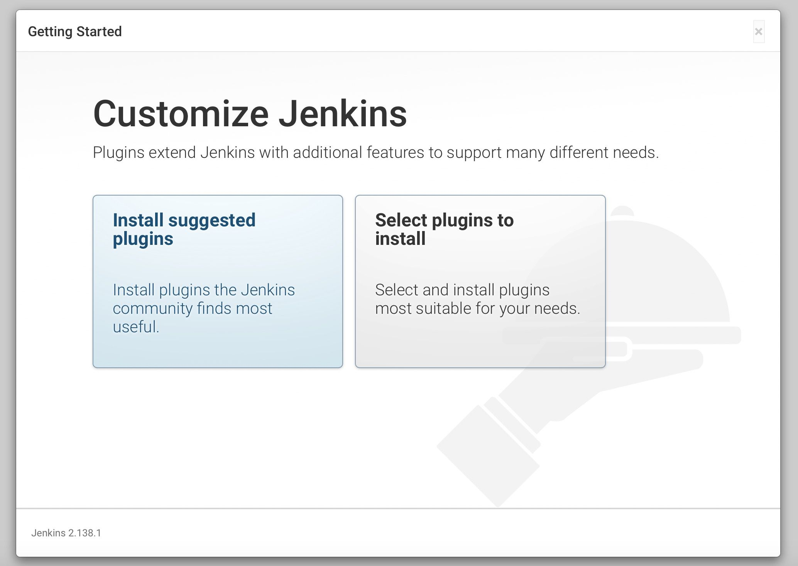

# install-Jenkins Ubuntu 20.04 LTS
How to install Jenkins Your Own 

Jenkins installers are available for several Linux distributions like 

- Debian/Ubuntu

- Fedora

- Red Hat/Alma/Rocky

this tutorial will use ubuntu 20.04 LTS

# Prerequisites
## server VPS (Virtual Private Server)

- Minimum hardware requirements:

| RAM | Disk Space    | OS              |
| :-------- | :------- | :------------------------- |
| `256 MB` | `1 GB` | UBUNTU 20.04 LTS |


- Recommended hardware configuration for a small team:

| RAM | Disk Space    | OS              |
| :-------- | :------- | :------------------------- |
| `4 GB` | `50 GB` | UBUNTU 20.04 LTS |

## Software requirements:
 
- [java verison 11+](https://www.jenkins.io/doc/book/platform-information/support-policy-java/)</br>
- chrome or firefox and etc (to acces your jenkins server)
- jenkins.war

### step 1 install java 11
```bash
  apt install openjdk-11-jdk-headless
```


### step 2 download generic latest version jenkins (extension .war)
```bash
  mkdir jenkins
```
```bash
  cd jenkins
```
```bash
  wget https://get.jenkins.io/war-stable/2.426.1/jenkins.war
```
```bash
  ls
```


### run jenkins.war file with customes port, add sintax '&' for running in the backround 
```bash
  java -jar jenkins.war --httpPort=7070 &
```


### access jenkins server vi Chrome or firefox
https://yourIPserver:7070


### Jenkins firstime password


you can check your password in /root/.jenkins/secrets/initialAdminPassword

```bash
cat /root/.jenkins/secrets/initialAdminPassword
```

### jenkins custome plugin for the first time


### setup admin account for the first time


### your jenkins 


